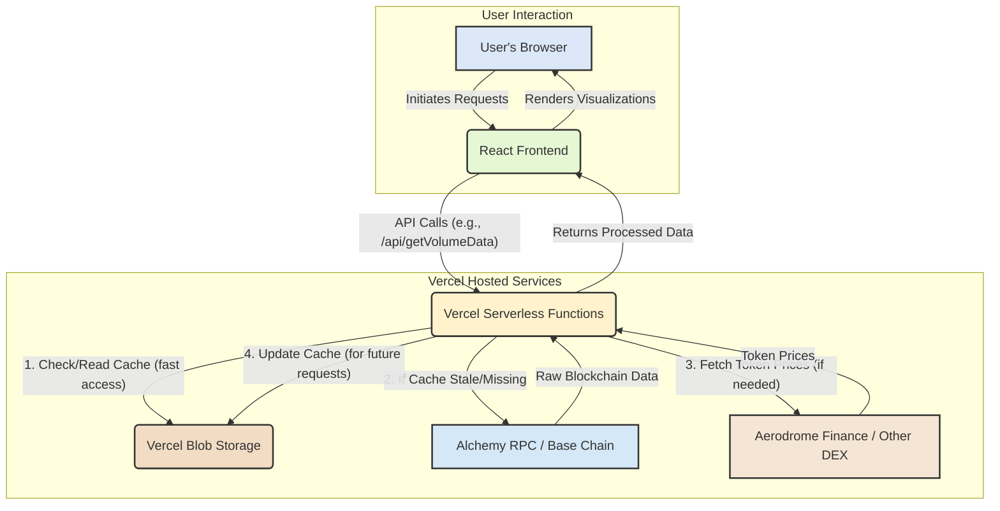

# Cypher Blockchain Analytics

A web application for visualizing and analyzing crypto card load patterns on the Base chain. This tool provides insights into USD load volumes and helps understand individual wallet activity.

## Features

- **USD Load Volume Visualization**: Displays daily, weekly, and monthly USD load volumes. This is calculated based on token receipts by the designated Cypher master wallet, providing a clear overview of card loading activity.
- **User Wallet Analysis**: For any given Base chain wallet address, the application identifies and presents the top 10 counterparties based on transaction count, including automated protocol identification for enhanced clarity.

## Tech Stack

- **Frontend**: React with TypeScript
- **Styling**: Tailwind CSS
- **Charts**: Chart.js with react-chartjs-2
- **Blockchain Interaction**: Alchemy SDK (for Base Mainnet), viem
- **Date Handling**: date-fns

## Setup Instructions

1. Clone the repository:
   ```bash
   git clone <repository-url>
   cd cyph
   ```

2. Install dependencies:
   ```bash
   npm install
   ```

3. Set up environment variables:
   Create a `.env` file in the root directory with the following variables:
   ```
   ALCHEMY_API_KEY=your_alchemy_api_key
   CYPHER_MASTER_WALLET=0xcCCd218A58B53C67fC17D8C87Cb90d83614e35fD
   PRELOAD_API_KEY=your_preload_api_key
   BLOB_READ_WRITE_TOKEN=your_vercel_blob_token (for production)
   ```

4. Run the development server:
   ```bash
   npm run dev
   ```
   This will start both the frontend and API server.

5. Build for production:
   ```bash
   npm run build
   ```

## Deployment on Vercel

This project is optimized for seamless deployment on Vercel:

1. Push your code to GitHub.
2. Go to [Vercel](https://vercel.com) and sign up/login.
3. Click "New Project" and import your GitHub repository.
4. Configure the following environment variables in the Vercel project settings:
   - `ALCHEMY_API_KEY`: Your Alchemy API key for Base Mainnet
   - `CYPHER_MASTER_WALLET`: The wallet address to analyze (0xcCCd218A58B53C67fC17D8C87Cb90d83614e35fD)
   - `PRELOAD_API_KEY`: A secret key to secure the preload cache API endpoint
   - `BLOB_READ_WRITE_TOKEN`: Vercel Blob Storage token for caching transaction data
5. Click "Deploy"

### Adding Serverless API Routes (Backend Functionality)

Vercel makes it straightforward to add serverless functions:

1. Create an `/api` directory at the root of your project.
2. Add your serverless function files (e.g., `api/getVolumeData.js`) within this directory.
3. Vercel will automatically deploy these files as API endpoints.

Example API Endpoint (api/getVolumeData.js):

```javascript
// api/getVolumeData.js
import { createPublicClient, http } from 'viem';
import { base } from 'viem/chains';
// Import other necessary libraries for pricing (e.g., from Aerodrome Finance)

export default async function handler(req, res) {
  try {
    // Real implementation to fetch blockchain data
    // Use viem to interact with Base chain
    // Query Aerodrome Finance for historical prices
    
    // Return data
    res.status(200).json({ data: [...] });
  } catch (error) {
    res.status(500).json({ error: error.message });
  }
}
```

## Architecture



## Assumptions and Design Choices

This section outlines key architectural decisions and underlying assumptions:

- **Direct Blockchain Interaction**: The application directly queries the Base chain via the Alchemy SDK and viem for real-time transaction data. This avoids reliance on a separate database for raw blockchain events.
- **Optimized Block Range Queries**: Data fetching from the blockchain is optimized by querying specific block ranges, reducing API call overhead and improving performance.
- **Hybrid Caching System**: To minimize redundant API calls and enhance user experience, a hybrid caching approach is employed:
  - Local Caching: Data is cached locally in the browser for immediate retrieval.
  - Persistent Blob Storage (Vercel): Data is also persistently cached on Vercel's blob storage. The application stores lastUpdatedTime and lastBlockNumber within the JSON cache file metadata to determine if the cache requires an update. Cache is refreshed if older than 15 minutes.
  - Cache Invalidation & Preloading: A cron job (or similar mechanism) can be readily configured on Vercel to trigger the incrementalCacheFetch and preloadCache functions, ensuring the blob cache remains fresh and preloaded.
- **Hardcoded Protocol Identification**: A static lookup table is currently used to identify common protocols and exchanges on the Base chain for the user wallet analysis feature.
- **Error Resilience**: The application implements graceful degradation when API services are unavailable:
  - If Alchemy API fails, the frontend displays appropriate error messages while still showing any cached data that's available
  - The system prioritizes showing partial data over no data, ensuring users always have access to some level of analytics
  - API endpoints include comprehensive error handling to prevent cascading failures
- **Metrics and Observability**: The application leverages Vercel's built-in analytics and monitoring capabilities:
  - Real-time performance metrics for both frontend and API functions
  - Detailed logs for debugging and troubleshooting
  - Deployment and runtime error tracking
- **CI/CD Pipeline**: The project implements continuous integration and deployment through GitHub and Vercel:
  - Automatic deployments triggered by pushes to the main branch
  - Preview deployments for pull requests
  - Environment-specific configuration for development, staging, and production

## Live Demo

👉 [https://cyph-plum.vercel.app/](https://cyph-plum.vercel.app/)

## Future Enhancements

These are planned features and improvements for future iterations:

- **Expanded Protocol Database**: Significantly enlarge the protocol identification database to cover a broader spectrum of DeFi protocols, DEXes, and other dApps on Base.
- **Cross-Chain Analysis**: Implement functionality to compare and analyze crypto card activity across different Layer 2 solutions and potentially other EVM-compatible chains.
- **Detailed Transaction Enrichment**: Integrate more granular transaction analysis, including real-time or historical token price information to provide more accurate USD values for individual transactions.
- **Robust Data Persistence Layer**: Introduce a more sophisticated and scalable data persistence layer (e.g., a dedicated database) for long-term storage and complex analytical queries, moving beyond Vercel's blob storage for core data.
- **Advanced Data Caching & Invalidation**: Develop a more dynamic and intelligent caching strategy with fine-grained control over cache invalidation based on specific blockchain events or time intervals.
- **User Authentication & Personalization**: Allow users to save favorite wallet addresses, track specific metrics, or receive alerts.
- **Expanded Test Coverage**: Build upon the existing test foundation to implement a comprehensive test suite:
  - The project includes initial unit tests for core utilities and data processing functions
  - Expand with more integration tests for API endpoints and blockchain interactions
  - Add end-to-end tests for critical user flows
  - Implement mock services for blockchain API testing
